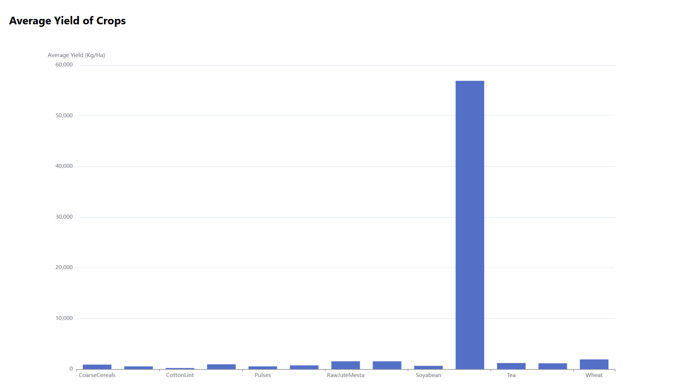
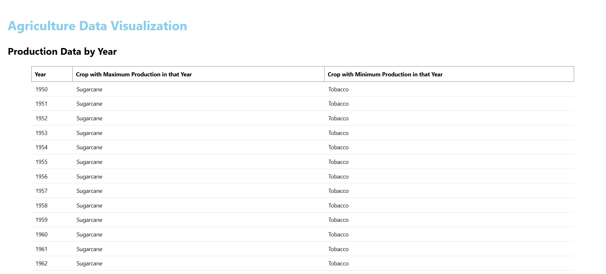

# Agriculture Data Visualization

This project visualizes agricultural data, showcasing crop production trends and average yields over the years. It provides insights into crop performance, helping users understand which crops had maximum and minimum production values and their average yields.

## Table of Contents

- [Project Overview](#project-overview)
- [Features](#features)
- [Technologies Used](#technologies-used)
- [Dataset](#dataset)
- [Setup Instructions](#setup-instructions)
- [File Structure](#file-structure)
- [Screenshots](#screenshots)

## Project Overview

The Agriculture Data Visualization project aims to display aggregated crop production data and yield statistics in a visually meaningful way. It uses data parsing techniques to extract key insights from a dataset, displaying the results through a table and bar chart.

### Key Insights Produced:

- Maximum and minimum production crops by year.
- Average yield of crops for better understanding of crop performance.

## Features

- **DataTable**: Displays production data aggregated by year, including crop names with maximum and minimum yields.
- **BarChart**: Visualizes average crop yields, helping identify trends in agricultural productivity.
- **Responsive Design**: The app is styled using Mantine components, ensuring a clean, modern UI.

## Technologies Used

- **React**: For building the front-end user interface.
- **Mantine**: A React component library providing reusable UI components.
- **ECharts**: A powerful charting library used to render bar charts.
- **DataParser Functions**: Helper functions to process raw agricultural data into structured formats for the table and chart.
- **JSON Dataset**: The dataset contains crop production and yield data.

## Dataset

The project uses a JSON dataset named `Dataset.json` containing agricultural data. The structure of the dataset includes:

```json
{
  "Country": "India",
  "Year": "2018",
  "Crop Name": "Wheat",
  "Crop Production (UOM:t(Tonnes))": 1000,
  "Yield Of Crops (UOM:Kg/Ha(KilogramperHectare))": 3000
}
```


## Setup Instructions

Follow these steps to set up and run the project locally:

### Prerequisites

1. **Node.js and npm**: Ensure you have Node.js installed.
2. **Clone the repository**:

```bash
git clone https://github.com/shubhamMadheshiya/agriculture-data-visualization.git

cd agriculture-data-visualization

```

3. **Install dependencies:**:

```bash
npm install
```
4. **Run the Application:**:

```bash
npm run dev  
```
This will launch the app in your browser at [http://localhost:5173/](http://localhost:5173/).


## Usage

1. **View Production Data by Year**: Navigate to the "Production Data by Year" section to view the DataTable.
2. **View Crop Yield Statistics**: Navigate to the "Average Yield of Crops" section to view the BarChart.

## File Structure
```
.
├── README.md               # This file, containing detailed project information.
├── public                  # Contains static assets that are publicly accessible.
│   └── index.html          # The main HTML file served by the React app.
├── src                     # The main source directory.
│   ├── assets              # Contains static assets like images or stylesheets.
│   ├── components          # UI components used throughout the app.
│   │   ├── BarChart.tsx    # Component rendering the bar chart.
│   │   └── DataTable.tsx   # Component rendering the data table.
│   ├── data                # Folder containing the dataset.
│   │   └── Dataset.json    # Sample dataset used for visualization.
│   ├── services            # Data processing and parsing functions.
│   │   ├── dataParser.ts   # Functions to parse and transform data.
│   ├── App.tsx             # The main entry point of the React app.
│   └── index.tsx           # Renders the App component and handles app initialization.
└── package.json            # Project configuration and dependencies.

```

## Screenshots

#### Bar Chart


#### Data Table


